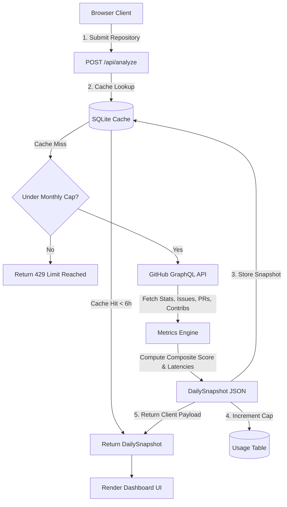

# 🩺 RepoPulse — Repository Health Diagnostic Dashboard

RepoPulse is a premium repository health diagnostic dashboard that aggregates repository data from GitHub's GraphQL API and computes key software development lifecycle (SDLC) health metrics. It provides real-time insights into issue triage velocity, pull request turnaround times, community engagement, and historical trends, culminating in a 0–100 **Composite Health Score** and letter grade (A–F).

Designed with a high-fidelity glassmorphic dark interface, RepoPulse features an interactive 3D System Architecture pipeline and Daytona-inspired synced tab documentation to detail its production code and API flows.

---

## 🚀 Key Features

* **Composite Health Score (A–F)**: Aggregates weights across four key sub-metrics (Response Time, PR Velocity, Triage Health, and Community Growth) using a linear decay rating model.
* **Issue Response Metrics**: Measures median time-to-first-response, closure latency, stale rates (no updates in 30+ days), and labels breakdown.
* **PR Velocity Analysis**: Evaluates PR merge rate, average review rounds, median turnaround latency, and stale PR backlog.
* **Contributor Leaderboards**: Tracks overall contributor size, new contributors joining in the last 30 days, and a top-10 contributor ranking.
* **Interactive Trend Charts**: Renders historical repository metrics (stars, open issues/PRs, contributor additions) over time using customized Line, Bar, and Radar charts.
* **3D Pipeline Simulation**: Features a step-by-step sequential R3F/Drei 3D model simulating the request-and-caching architecture, complete with traveling data particles and animated pipeline highlights.
* **Synced Documentation Tab View**: Includes a sticky code terminal and clickable feature list with smooth slide-and-fade code switching transitions.
* **6-hour Cache & Usage Cap**: Prevents API limit exhaustion using a local SQLite cache (via Prisma) and enforces a global monthly lookup cap.

---

## 🏗️ System Architecture & Data Flow

RepoPulse operates on a Next.js App Router serverless model backed by SQLite. 



### Request Lifecycle (`POST /api/analyze`)
1. **Cache Validation**: Checks the `repo_cache` SQLite table. If a record matches `owner/repo` and is less than 6 hours old, it returns the cached `DailySnapshot` JSON instantly, avoiding GitHub API calls.
2. **Monthly Cap Check**: If there is a cache miss, the API queries the `usage` table for the current month. If the global cap (default `50` lookups/month) is exceeded, it returns a `429 Limit Reached` response.
3. **GraphQL Aggregation**: Fires four parallel GraphQL queries within a single `Promise.all` (fetching repository metadata, paginated issues, paginated pull requests, and contributor history) to bypass API waterfalls and limit cost under GitHub's 5,000 points/hour rate limit.
4. **Metrics Computation**: Calculates all median durations, backlog staleness, and decay curves on the server.
5. **Database Write**: Serializes the computed snapshot as JSON, writes it to the SQLite database, increments the calendar month lookup counter, and returns the snapshot to the client.

---

## 🛠️ Project Structure

```
├── app/
│   ├── layout.tsx                  # Root layout containing fixed header and author footer
│   ├── page.tsx                    # Landing page, submission form, and unboxed features grid
│   ├── globals.css                 # Global styling system, variables, and typography definitions
│   ├── api/
│   │   ├── analyze/route.ts        # POST - cache checking, cap enforcement, and aggregation Orchestrator
│   │   └── usage/route.ts          # GET - current monthly usage cap status
│   └── dashboard/[owner]/[repo]/
│       └── page.tsx                # Tabbed health dashboard (Overview, Issues, PRs, Contributors, Trends)
├── components/
│   ├── SystemArchitecture3D.tsx    # Interactive R3F 3D model with sequential step-by-step pipeline animations
│   ├── DocsSection.tsx             # Interactive Daytona-style documentation tabs with sticky code terminal
│   ├── GradeBanner.tsx             # Grade badge and description card
│   ├── StatCard.tsx                # Numeric key metrics displaying card
│   ├── BreakdownBar.tsx            # Visual progress-bar breakdown component
│   ├── MetricsGrid.tsx             # Grid layout displaying key latency stats
│   ├── LabelTable.tsx              # Tabular breakdown of issue label categories
│   ├── PRTable.tsx                 # Detailed PR history and review rounds
│   ├── ContributorList.tsx         # Contributor leaderboard and top-10 metrics
│   └── TrendCharts.tsx             # Radar, line, and bar chart canvas renders via Chart.js
├── lib/
│   ├── types/index.ts              # Core TypeScript type definitions
│   ├── github/                     # GitHub GraphQL connection client and query configurations
│   ├── metrics/                    # Metric engines (health score, issue latencies, PR calculations)
│   ├── utils/                      # Helper functions for math, medians, and durations
│   ├── aggregator.ts               # Aggregates raw GraphQL payloads into DailySnapshots
│   └── db.ts                       # Prisma connection wrappers and database helpers
├── prisma/
│   └── schema.prisma               # SQLite database schemas for repoCache and usage tables
├── scripts/
│   └── slack-digest.ts             # Script to post weekly database lookup summary to Slack
└── .github/workflows/
    └── slack-digest.yml            # Weekly cron workflow (runs Mondays at 09:00 UTC)
```

---

## 💻 Local Development Setup

### Prerequisites
* **Node.js**: Version 18.0.0 or higher
* **GitHub PAT**: A personal access token to authenticate GraphQL queries (no write permissions required)

### Step 1: Clone and Install
Clone the project repository and install its dependencies:
```bash
git clone https://github.com/tarunagnihotri534/RepoPulse.git
cd RepoPulse
npm install
```

### Step 2: Acquire a GitHub Personal Access Token (PAT)
1. Go to your GitHub account **Settings → Developer settings → Personal access tokens → Fine-grained tokens**.
2. Click **Generate new token**.
3. Set **Repository access** to **Public Repositories (read-only)**.
4. Set **Repository permissions** to **Metadata (Read-only)**.
5. Click **Generate token** and copy it.

### Step 3: Configure Environment Variables
Create a `.env.local` file in the root of the project:
```bash
cp .env.example .env.local
```

Open `.env.local` and configure your credentials:
```env
GITHUB_TOKEN=ghp_your_token_here
DATABASE_URL=file:./tracker.db
MONTHLY_CAP=50
```

### Step 4: Initialize the Local SQLite Database
Run the Prisma command to sync your database schema and build the client:
```bash
npx prisma db push
```
This generates a local SQLite file named `tracker.db` in your project root.

### Step 5: Start the Development Server
Launch the local Next.js development server:
```bash
npm run dev
```
Open [http://localhost:3000](http://localhost:3000) in your web browser. You can now analyze any public repository (e.g. `facebook/react`, `vercel/next.js`).

---

## 📈 Metric Calculations & Decays

The **Composite Health Score** integrates metrics over a 0–100 scale. It divides grading into 4 sub-scores (weighted at 25 points each):

1. **Response Time**: Evaluates median first response. Full score (25pts) is achieved for response times $\le$ 4 hours, decaying linearly to 0 points at $\ge$ 168 hours (7 days).
2. **PR Velocity**: Evaluates PR turnaround. Full score is awarded for median merge times under 12 hours, decaying to 0 points at 14 days.
3. **Triage Health**: Deducts points based on stale issues/PR percentages and backlog density.
4. **Community Growth**: Evaluates developer retention and contributor growth margins over the past 30 days.

Grades correspond to the following scale:
* **A**: $\ge$ 85
* **B**: $\ge$ 70
* **C**: $\ge$ 55
* **D**: $\ge$ 40
* **F**: $<$ 40

---

## 🌐 Production Deployments

### Deploying to Railway (Recommended for SQLite persistence)
Railway supports persistent volumes, which keeps SQLite databases intact:
1. Create a new Railway project linked to your GitHub repository.
2. Under the service settings, create a **Volume** and mount it at `/data`.
3. Set the following environment variables:
   * `DATABASE_URL` = `file:/data/tracker.db`
   * `GITHUB_TOKEN` = `your_github_token`
   * `MONTHLY_CAP` = `50`
4. Deploy the application. Railway will execute the schema updates automatically on build.

### Deploying to Vercel
Vercel's serverless environment provides an ephemeral filesystem, meaning your local database resets on every runtime recycling.
> [!IMPORTANT]
> If deploying to Vercel, it is recommended to replace the SQLite configuration in `prisma/schema.prisma` with a remote PostgreSQL or MySQL endpoint, or connect SQLite remotely using [Turso](https://turso.tech) (via the LibSQL driver).

---

## 📬 Automated Weekly Slack Digest

You can post automated summaries of all cached repositories and search statistics to Slack using the incoming webhook script:

```bash
# Dry run to preview the Slack Block Kit output
DATABASE_URL=file:./tracker.db npx ts-node --esm scripts/slack-digest.ts --dry-run

# Execute and post the digest to Slack
DATABASE_URL=file:./tracker.db SLACK_WEBHOOK_URL=https://hooks.slack.com/services/YOUR/WEBHOOK/URL npx ts-node --esm scripts/slack-digest.ts
```

This is automated via the GitHub Actions cron located at `.github/workflows/slack-digest.yml` which triggers every Monday at 09:00 UTC. To configure this, add your `SLACK_WEBHOOK_URL` to your GitHub repository secrets.

---

## 🔧 Troubleshooting

### Prisma EPERM / File Lock Errors (Windows)
When compiling or running production builds on Windows, you may encounter `EPERM` database access errors if multiple server compilation processes attempt to overwrite or lock `tracker.db`. Stop any active terminal dev servers, delete `.next/` and `node_modules/.prisma/`, and execute `npx prisma generate` followed by `npm run dev`.

### GitHub API Rate Limits
Each unique repository search utilizes roughly 100–350 GraphQL points. The default monthly limit of 50 searches is designed to keep your personal token well within GitHub's standard 5,000 points/hour limit. If rate limit notifications occur, wait for the window reset or swap your token in `.env.local`.

---

**Author — Tarun kumar Agnihotri**  
Connect with me on [GitHub](https://github.com/tarunagnihotri534) or [LinkedIn](https://www.linkedin.com/in/tarun-agnihotri69).
